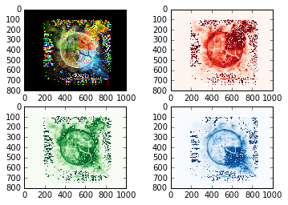
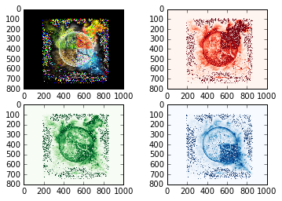

UECM3033 Assignment #2 Report
========================================================

- Prepared by: Lim Sip Yee
- Tutorial Group: T3

--------------------------------------------------------

## Task 1 --  $LU$ Factorization or SOR method

The reports, codes and supporting documents are to be uploaded to Github at: 

[https://github.com/sipyeelim/UECM3033_assign2.git](https://github.com/your_github_id/UECM3033_assign1)

Explain your selection criteria here.

Before decided choosing LU method or Sor method to solve this problem, we will check whether matrix A is positive definite or not. If it is positive definite, then we can choose Sor method to solve the problem. To check matrix A is positive definite, we need to see whether it can apply the Cholesky factorization or not. If matrix A cant apply this Cholesky factorization then we would choose LU method to solve this problem.

Explain how you implement your `task1.py` here.

First, for the LU method. We define a function Ludecomp(A) which take in the matrix A, after that we define another function call lu(A,b). It solve the matrix A from Ax=b and return the value (A,b). 

Second, for the Sor method. We need to compute the omega first, so we using the function omegasearch(A,D). This function will find the omega by the formula  omega = 2*(1-np.sqrt(1-eig**2))/eig**2, and the eig is the maximum value of eigenvalue. As we mention above, matrix A must be positive definite. So we set a range of 1< omega < 2 to ensure convergence when it is positive definite.

Thrid, we set the iteration will begin from x(0),zero vector and use this vector to get x(j) until desired iteration. Then, the matrix A and b will move to the sol = np.linalg.solve(A,b) and solve it with the condition. The condition we set is the matrix need to be positive definite matrix, and it can apply the Cholesky factorization. If the condition fulfill, it will use Sor method to solve it else it will using Lu method.

For the result, it give both 3x3 and 6x6 matrices solved by Lu method. The 3x3 matrix given [ 1. 1. 1.] and the 6x6 matrix given [ 1. -1. 4. -3.5 7. -1. ].

---------------------------------------------------------

## Task 2 -- SVD method and image compression

Put here your picture file (image.jpg)

How many non zero element in $\Sigma$?
All element like red, blue and green in $\Sigma$ are non zero element.

A lower resolution of sigma 30

A good resolution of sigma 200

To generate these pictures, first we need to read the image.jpg into the img that contain 3 matrices which is r, g and b. Each of the matrices r, g and b is a 3 dimension matrix. We named the Ur, Sr and Vr for the red matrix to get the U, sigma and V of the matrix by using scipy.linalg.svd. Also repeat it with green matrix as Ug, Sg, Vg and blue matrix as Ub, Sb and Vb to find the matrices.

After that, we use the numpy.count_nonzero to find out the none zero element and use the "plt.figure" to plot the image. Since we need to construct a lower resolution matrix, our image need to compress by keeping only the first 30 of none zero elements in the sigma and other become the zero elements in the sigma.

After create the low resolution image, we still need to create another better resolution image. So we created the self define function to plot the image. For the first, we use the Sr.copy. Sr.copy is to prevent loss of information from the copy of the original sigma and we apply this to red, blue and green matrices. After that, we use the r_a[n:800]=np.zeros_like(Sr[n:800]) to keep or set the element whether become zero or none zero. By using sp.linalg.diagsvd, we can avoid the dimension error happened when it combine U, sigma and v by dot multiplication to let r_a changes to dimension (800x1000) from the originally (800,1), its same goes to r_b and r_g. The new matrix will be create by the dot multiplication of np.dot. Finally, a new lower resolution image plotted.    

What is a sparse matrix?

Sparse matrix is a matrix that contain the most of zero elements. But if the matrix has the most of nonzero element, then the matrix is considered dense. In this case, we keep the first 30 element of sigma and other set to be zero, this will be forming the sparse matrix. The dimension of the sigma is change to the (800,1000) which will create a large sparse matrix. After that, the sparse matrix will help to create a lower resolution picture when it is using the dot multiplication to combine the U and V.

-----------------------------------

last modified: change your date here
